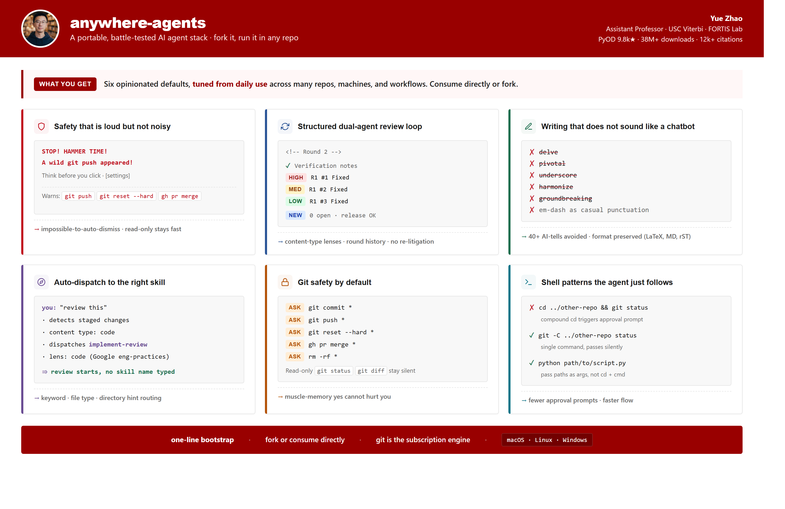
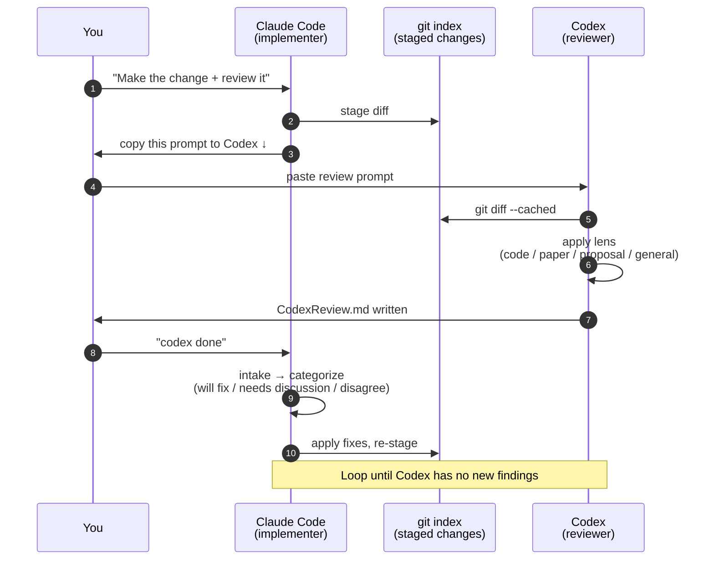

<a id="readme-top"></a>

<div align="center">

# anywhere-agents

**Your AI agents, configured once and running everywhere.**

A maintained, opinionated configuration for Claude Code and Codex that follows you across every project, every machine, every session.

[](https://pypi.org/project/anywhere-agents/)
[](https://www.npmjs.com/package/anywhere-agents)
[](LICENSE)
[](https://github.com/yzhao062/anywhere-agents/actions/workflows/validate.yml)
[](https://github.com/yzhao062/anywhere-agents)

[Install](#install) &nbsp;•&nbsp;
[Workflow](#the-agentic-workflow-this-encodes) &nbsp;•&nbsp;
[Features](#what-you-get-after-setup-5-minutes) &nbsp;•&nbsp;
[Fork](#fork-and-customize-make-it-yours) &nbsp;•&nbsp;
[Day-to-day](#using-it-day-to-day)

</div>



> [!NOTE]
> Maintained by [Yue Zhao](https://yzhao062.github.io) — USC Computer Science faculty and author of [PyOD](https://github.com/yzhao062/pyod) (9.8k★, 38M+ downloads, ~12k research citations). This is the sanitized public release of the agent config used daily since early 2026 across research, paper writing, and dev work (PyOD 3, LaTeX, admin) on macOS, Windows, and Linux. Not a weekend project.

## The problem

You use AI coding agents across many repositories. You have preferences — how reviews should happen, what writing style to use, which Git operations must require confirmation, which overused words the agent should never emit. Today those preferences live in one of these broken states:

- Scattered across per-repo `CLAUDE.md` / `AGENTS.md` files that drift over time
- Copy-pasted from project to project, diverging on every tweak
- Only in your head, re-explained to every agent in every session

`anywhere-agents` fixes this by publishing one curated, maintained agent stack that any project can consume in two lines of setup. When the maintainer improves something, every consuming repo picks it up on the next session.

## The agentic workflow this encodes

This configuration reflects months of daily use as a researcher and developer. None of the choices below is novel alone — the value is the combination.

| Principle | What it means here |
|-----------|---------------------|
| **Git is the substrate** | `AGENTS.md`, skills, settings, sync mechanism — all Git-controlled. Subscribe via `git pull`, diverge via fork, undo via `git revert`. No hidden cache, no opaque state. |
| **Implementer + gatekeeper** | Claude Code writes. Codex reviews. Shared contract (`implement-review`), independent judgment. Either solo works; the pair catches more. |
| **`implement-review` is the gate** | Before merge / push / PR, a structured loop runs. Content-type lenses (code, paper, proposal, general), round history, categorized findings. Catches overclaim, missing tests, style drift. |
| **IDE helps but is not required** | PyCharm, VS Code, or terminal — all work. Config does not assume a specific IDE. |
| **MCP on Unix, terminal on Windows** | Codex-as-MCP into Claude Code works smoothly on macOS / Linux. On Windows: keep Codex in its own terminal — MCP has rough edges (approval dialogs, antivirus false positives). |

## What you get after setup (5 minutes)

Every agent session in any consuming repo inherits these defaults. See the hero image above for visuals.

- 🛡️ **Loud safety** — destructive Git/GitHub commands (`git push`, `git reset --hard`, `gh pr merge`) hit a `STOP! HAMMER TIME!` block via `guard.py`. Shell deletes (`rm -rf`) are routed through explicit permission prompts. Read-only ops stay silent.
- 🔄 **Dual-agent review** — `implement-review` runs a structured Codex review with content lenses (code / paper / proposal / general), round history, priority-tagged findings.
- ✍️ **Consistent writing** — 40+ AI-tell words banned (`delve`, `pivotal`, `underscore`, …). No em-dashes as casual punctuation. Format preserved.
- 🧭 **Auto skill dispatch** — `my-router` picks the right skill from prompt + file type + directory. "review this" → `implement-review` + code lens.
- 🔒 **Git safety** — `commit`, `push`, `reset --hard`, `pr merge`, `rm -rf` always confirm. `git status` / `diff` / `log` stay fast.
- ⚡ **Shell hygiene** — agent prefers `git -C <path>` over `cd X && cmd`. Fewer approval prompts.
- 🩺 **Session-start checks** — OS, model, effort, Codex config, outdated Actions pins reported on every session.

No YAML to configure. Git handles subscription and updates. Override per project in `AGENTS.local.md`.

<details>
<summary><b>How the review loop flows</b> (sequence diagram)</summary>



</details>

## Install

> [!TIP]
> The simplest install is to tell your AI agent: _"Install anywhere-agents in this project."_ It will pick the right command from PyPI or npm.

Any of these commands do the same thing — download the bootstrap script and run it in the current directory.

```bash
# Python (primary, zero-install if you have pipx)
pipx run anywhere-agents
# or two-step:
pip install anywhere-agents && anywhere-agents

# Node.js (zero-install if you have Node 14+)
npx anywhere-agents
```

<details>
<summary><b>Raw shell (no package manager required)</b></summary>

macOS / Linux:

```bash
mkdir -p .agent-config
curl -sfL https://raw.githubusercontent.com/yzhao062/anywhere-agents/main/bootstrap/bootstrap.sh -o .agent-config/bootstrap.sh
bash .agent-config/bootstrap.sh
```

Windows (PowerShell):

```powershell
New-Item -ItemType Directory -Force -Path .agent-config | Out-Null
Invoke-WebRequest -UseBasicParsing -Uri https://raw.githubusercontent.com/yzhao062/anywhere-agents/main/bootstrap/bootstrap.ps1 -OutFile .agent-config/bootstrap.ps1
& .\.agent-config\bootstrap.ps1
```

</details>

Source: [PyPI](https://pypi.org/project/anywhere-agents/) · [npm](https://www.npmjs.com/package/anywhere-agents) · [shell bootstrap](https://github.com/yzhao062/anywhere-agents/tree/main/bootstrap)

## Fork and customize (make it yours)

Want to diverge — change writing defaults, add your own skills, swap the reviewer? Standard Git, no special tooling.

1. **Fork** `yzhao062/anywhere-agents` to your GitHub account.
2. **Clone your fork and customize:**
   - `AGENTS.md` — user profile, writing style, agent roles
   - `skills/<your-skill>/` — add your own skills
   - `skills/my-router/references/routing-table.md` — register new skills with the router
3. **Repoint consumers** at your fork (change the URL in the bootstrap block of their `AGENTS.md`).
4. **Pull upstream updates** when you want them:
   ```bash
   git remote add upstream https://github.com/yzhao062/anywhere-agents.git
   git fetch upstream
   git merge upstream/main   # resolve conflicts as usual
   ```

Git is the subscription engine. Cherry-pick what you want, skip what you do not.

## Using it day-to-day

| Scenario | Do this |
|----------|---------|
| Add to a new project | Run any install command (`pipx run anywhere-agents`, `npx anywhere-agents`, or the raw shell commands) in the project root |
| Get latest updates | Just start a new agent session — bootstrap runs automatically |
| Force refresh mid-session | `bash .agent-config/bootstrap.sh` (or `.ps1` on Windows) |
| Customize one project without touching upstream | Create `AGENTS.local.md` in the project root — never overwritten by sync |

<details>
<summary><b>Force a refresh mid-session</b> (e.g., maintainer pushed a fix you need right now)</summary>

```bash
# Bash (macOS/Linux)
bash .agent-config/bootstrap.sh

# PowerShell (Windows)
& .\.agent-config\bootstrap.ps1
```

Both scripts are idempotent — safe to run any time. They fetch the latest `AGENTS.md`, sync skills, merge settings, and add `.agent-config/` to `.gitignore` if it is not already there.

</details>

<details>
<summary><b>Customize one specific project without touching upstream</b></summary>

Create `AGENTS.local.md` in the project root. Anything in it overrides the shared defaults and is never overwritten by bootstrap. Useful for project-specific permissions, domain glossaries, or opt-outs.

</details>

<details>
<summary><b>Repo layout</b> (what lives where)</summary>

```
anywhere-agents/
├── AGENTS.md                    # the opinionated configuration (curated defaults)
├── bootstrap/
│   ├── bootstrap.sh             # idempotent sync for macOS/Linux
│   └── bootstrap.ps1            # idempotent sync for Windows
├── scripts/
│   └── guard.py                 # PreToolUse hook: blocks destructive commands with loud warnings
├── skills/
│   ├── implement-review/        # structured dual-agent review loop (signature skill)
│   └── my-router/               # context-aware skill dispatcher (template — extend with your own)
├── .claude/
│   ├── commands/                # pointer files so Claude Code discovers the skills
│   └── settings.json            # project-level permissions
├── user/
│   └── settings.json            # user-level permissions, hook wiring, CLAUDE_CODE_EFFORT_LEVEL=max
├── tests/                       # bootstrap contract + smoke tests (Ubuntu + Windows CI)
└── .github/workflows/           # validation CI
```

</details>

## What is opinionated and why

Review these before adoption — they are the product, not background defaults.

| Opinion | Why |
|---------|-----|
| **Safety-first by default** | `git commit` / `push` always confirm. Guard hook has no bypass mode. |
| **Dual-agent review is default** | Claude Code implements; Codex reviews. Either solo still works; the second opinion is where the value is. |
| **Strong writing style** | 40+ banned words, no em-dashes as casual punctuation, no bullet-conversion of prose, no summary sentence at the end of every paragraph. Sound like you, not a chatbot. |
| **Session checks report, not fix** | Flags outdated Actions versions, wrong Codex config, model preferences — agents never silently change anything without telling you. |

Disagree with any of this? Fork it and edit.

<details>
<summary><b>What this is not</b></summary>

- Not a framework or CLI tool. No install step beyond the shell bootstrap. No YAML manifest.
- Not a universal multi-agent sync tool. Claude Code + Codex is the supported set. Other agents (Cursor, Aider, Gemini CLI) may work via the `AGENTS.md` convention but are not tested here.
- Not a marketplace or registry. One curated configuration, one maintainer.

</details>

<details>
<summary><b>Related projects</b> (if <code>anywhere-agents</code> is not the right fit)</summary>

If you want a general-purpose multi-agent sync tool or a broader skill catalog, these take different approaches:

- [iannuttall/dotagents](https://github.com/iannuttall/dotagents) — central location for hooks, commands, skills, AGENTS/CLAUDE.md files
- [microsoft/agentrc](https://github.com/microsoft/agentrc) — repo-ready-for-AI tooling
- [agentfiles on PyPI](https://pypi.org/project/agentfiles/) — CLI that syncs configurations across multiple agents

`anywhere-agents` is intentionally narrower: a published, maintained, opinionated configuration — not a tool that manages configurations. Fork it if you like the setup; use one of the tools above if you want a universal manager.

</details>

<details>
<summary><b>Maintenance and support</b></summary>

- **Maintained:** the author's daily-use workflow. Changes land when the author needs them.
- **Not maintained:** feature requests that do not match the author's work. Users should fork.
- **Best-effort:** bug reports, PRs for clear fixes, documentation improvements.

See [CONTRIBUTING.md](CONTRIBUTING.md) for how to propose changes.

</details>

<details>
<summary><b>Limitations and caveats</b></summary>

- Primary support is Claude Code + Codex. Cursor, Aider, Gemini CLI may work via `AGENTS.md` but are untested here.
- Requires `git` everywhere. Requires Python (stdlib only) for settings merge; bootstrap continues without merge if Python is unavailable.
- Guard hook deploys to `~/.claude/hooks/guard.py` and modifies `~/.claude/settings.json`. To opt out of user-level modifications, remove the user-level section from `bootstrap/bootstrap.sh` / `bootstrap/bootstrap.ps1` in your fork.

</details>

## License

Apache 2.0. See [LICENSE](LICENSE).

<div align="center">

<a href="#readme-top">↑ back to top</a>

</div>
